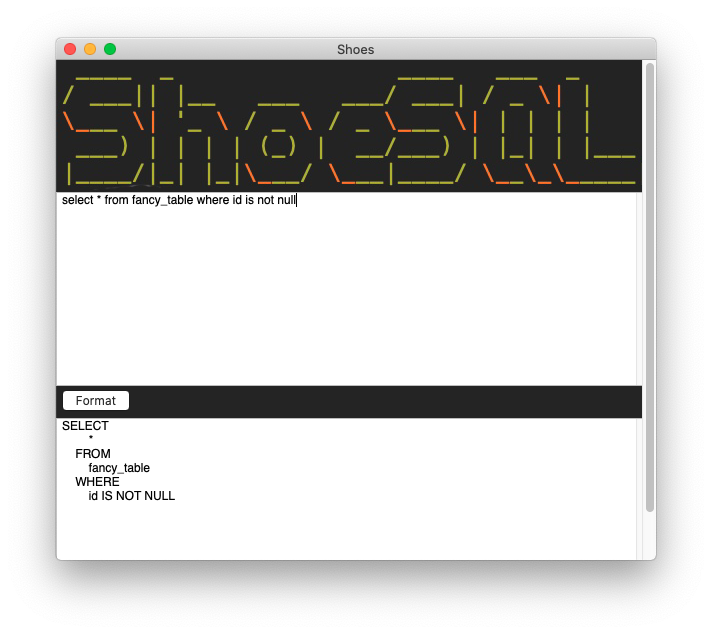

# shoesql
A SQL formatter desktop app written in ruby

ShoeSQL is a little desktop app that can format SQL strings so that you don't have to put your precious statements into just any website. (Ever wondered if those admins have logs?)

It's built with https://github.com/shoes/shoes3 and https://github.com/sonota88/anbt-sql-formatter.

## Running the app as Shoes app

Until there is a wrapped version of the application, you need to [download](http://shoesrb.com/downloads/) the appropriate shoes version for your operating system.
After checking out this repository, start shoes and load `lib/shoesql.rb`.

## Packaging as standalone app

- Open Shoes
- Select `Package A Shoes Application` option
- Select `lib.shy` as startup script
- Select `Shoes will be included with my app`
- Choose your architecture

## Creating the .shy file

- Open Shoes
- Select `Package A Shoes Application` option
- Select `directory` and then `lib/shoesql.rb` as startup script
- Shoes will then ask you to generate a `.shy` file

## Improvement ideas not yet implemented

- code highlighting?
- build pipeline that automatically creates OS X, windows and linux apps
- fancy app icon / logo

## Contributing

Please open a pull request.

## License

MIT
